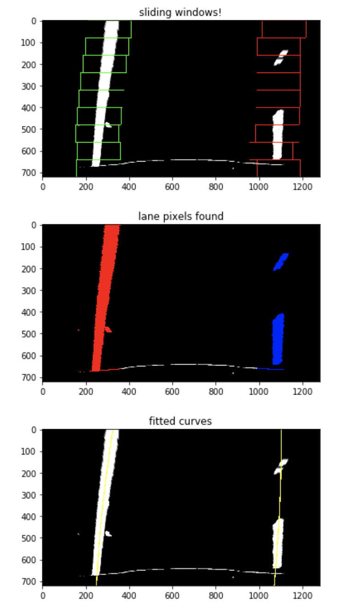

# Final Writeup

---

**Advanced Lane Finding Project**

The goals / steps of this project are the following:

* Compute the camera calibration matrix and distortion coefficients given a set of chessboard images.
* Apply a distortion correction to raw images.
* Use color transforms, gradients, etc., to create a thresholded binary image.
* Apply a perspective transform to rectify binary image ("birds-eye view").
* Detect lane pixels and fit to find the lane boundary.
* Determine the curvature of the lane and vehicle position with respect to center.
* Warp the detected lane boundaries back onto the original image.
* Output visual display of the lane boundaries and numerical estimation of lane curvature and vehicle position.

[//]: # (Image References)

[Rubric](https://review.udacity.com/#!/rubrics/571/view) Points

## Camera Calibration

[image1]: ./writeup_camera_calib2.jpg "Undistorted"

### 1. Briefly state how you computed the camera matrix and distortion coefficients. Provide an example of a distortion corrected calibration image.

The code for this step is contained in the first code cell of the IPython notebook located in `main.ipynb`

I start by preparing "object points", which will be the (x, y, z) coordinates of the chessboard corners in the world. Here I am assuming the chessboard is fixed on the (x, y) plane at z=0, such that the object points are the same for each calibration image.  Thus, `objp` is just a replicated array of coordinates, and `objpoints` will be appended with a copy of it every time I successfully detect all chessboard corners in a test image.  `imgpoints` will be appended with the (x, y) pixel position of each of the corners in the image plane with each successful chessboard detection.  

I then used the output `objpoints` and `imgpoints` to compute the camera calibration and distortion coefficients using the `cv2.calibrateCamera()` function.  I applied this distortion correction to the test image using the `cv2.undistort()` function and obtained this result: 

![alt text][image1]

## Pipeline (single images)
[image3]: ./writeup_binary.jpg "Binary Example"

### 1. Provide an example of a distortion-corrected image.

To demonstrate this step, I will describe how I apply the distortion correction to one of the test images like this one:


### 2. Describe how (and identify where in your code) you used color transforms, gradients or other methods to create a thresholded binary image.  Provide an example of a binary image result.

I used a combination of color and gradient thresholds to generate a binary image (Section 3 in `main.ipynb`).  Here's an example of my output for this step. A pixel would be activated if it satisfied any one of the following filters:

1. Sobel gradients in both X AND Y direction
2. Both magnitude AND direction based on sobel gradients
3. S channel from HLS

![alt text][image3]

[image4]: ./writeup_perspective_trf.jpg "Warp Example"

### 3. Describe how (and identify where in your code) you performed a perspective transform and provide an example of a transformed image.

The code for my perspective transform includes a function called `birds_eye()`, which appears in the **4th section** of `main.ipynb`. (I've also created an `inverse_birds_eye()` for use when plotting the lane visualization back later)

The `warper()` function takes as inputs an image (`img`), as well as source (`src`), and an optional margin (`offset`). The destination points are coded inside the function by referencing the image size as such:

```python
dst = np.float32([[offset, offset], 
                  [img_size[0]-offset, offset], 
                  [img_size[0]-offset, img_size[1]-offset], 
                  [offset, img_size[1]-offset]])
```

The source points are chosen by referencing a **straight line image** and manually picking out the four corners. In addition, because I'm only relying on one image, I **expand the view** slightly by using a multiplier.

```python
upper_line_width = 692-593
bottom_line_width = 1086-231
ppts = np.array([[593-upper_line_width*0.2,450],
                [692+upper_line_width*0.2,450],
                [1086+bottom_line_width*0.2,700],
                [231-bottom_line_width*0.2,700],
               ], np.int32)
```

This resulted in the following source and destination points:

| Source        | Destination   | 
|:-------------:|:-------------:| 
| 573, 450      | 50, 50        | 
| 711, 450      | 1230, 50      |
| 1257, 700     | 1230, 670      |
| 60, 700      | 50, 670      |

![alt text][image4]


### 4. Describe how (and identify where in your code) you identified lane-line pixels and fit their positions with a polynomial?

In **Section 5**, I create a function that finds the activated lane pixels. This function takes in the warped binary image (`binary_warped`) as well as some additional parameters for previously fitted polynomials (`prev_*_poly`) and activated points (`prev_*_points`). Using all this data, it identified lane pixels by:

1. If there is no prev data (i.e. `prev_*_*` are all `None`), then it uses the sliding window method.
2. If prev **poly** data is provided: it will subset the activated pixels around this polynomial, with `margin`
3. If `add_points_margin` is not None and prev **points** data is provided, it will also add the points around the previous polynomial, to *this* image's activated points.
    - This is to help deal with frames where there might no **no** activated pixels, especially the challenge videos
    - However, I did NOT use this in the main project output
    
```python
find_lane_pixels(binary_warped, prev_left_poly, prev_right_poly,
                 prev_left_points, prev_right_points,
                 margin, add_points_margin=None, draw_intermediate=False)
```

In **Section 6b**, I wrap the `find_lane_pixels` function in the main `fit_lane_curve` function, which takes an additional parameter called `weight`. This controls how much the new polynomial should be added to the previous polynomial.

```python
fit_lane_curve(binary_warped, 
               prev_left_poly=None, prev_right_poly=None,
               prev_left_points=None, prev_right_points=None,
               margin=30, weight=0.2,
               add_points_margin=None, draw_intermediate=False)
```


- This helps prevent the curve from changing too quickly/drastically due to noisy data
- The weightage is done by simply doing a weighted sum of the calculated X-points: 
    - `fitted_left_x = weight*_fitted_left_x + (1-weight)*prev_fitted_left_x`





[image6]: ./writeup_final.jpg "Output"

### 5. Describe how (and identify where in your code) you calculated the radius of curvature of the lane and the position of the vehicle with respect to center.

In **Section 6**, I identify the width and length of the lane based on the *warped* image, and used that to determine `xm_per_pix` and `ym_per_pix`. Then, I used the curvature formula to calculate the radius of the lane.

For position with respect to the center, I calculate the midpoint of the identified lane based on the left & right polynomials, at `y=img_height` (i.e. the very bottom of the image). Then, I compare this to the midpoint of the image. If the **lane midpoint > image midpoint**, it means that the driver is leaning **left**.

These functions are then added to the `fit_lane_curve` function in **Section 6b**.

### 6. Provide an example image of your result plotted back down onto the road such that the lane area is identified clearly.

In **Sections 7 and 8**, I lay out the functions needed to (1) create the overlay image; (2) add it to the original (warped) image and (3) annotate.

- `draw_curve()`: draws the line lanes
- `fill_space()`: fills in the lane
- `make_overlay()`: creates a drawn image with the lane lines and filled space
- `weighted_img()`: combines the overlay image and real image
- `annotate()`: adds text


The output looks like this:

![alt text][image6]


[video1]: ./project_output.mp4 "Video"

## Pipeline (video)

### 1. Provide a link to your final video output.  Your pipeline should perform reasonably well on the entire project video (wobbly lines are ok but no catastrophic failures that would cause the car to drive off the road!).

Here's a [link to my video result](./project_output.mp4)

---

## Discussion

### 1. Briefly discuss any problems / issues you faced in your implementation of this project.  Where will your pipeline likely fail?  What could you do to make it more robust?

**Problems and issues during development**
- Depending on how much "previous" data I use, the processing of the video could become very slow
- There is one scene where the road changes color, and it caused my right lane to swerve and merge into the left. Additionally, since I only detect activated pixels in the vicinity of the polynomial, it meant that I couldn't "re-detect" the right lane for the rest of the video.

**Potential failures**
- Changes in the color of the road (e.g. if it was repaved) could create "false" activated pixels in the binary image
- Roads under poor lighting conditions e.g. very bright/very dim/fog
- Lane projections far away might be slightly off: warping and binary detection may create unnecessary noise that throws the curve off
- Setting a weight may cause the curve to change **too slowly**, especially when there are sharp turns

**Robustness**
- Fine tuning the binary filters to work under many different circumstances
- Apply noise filters to the output of the binary filters
- Periodically run the sliding window lane detection method again to get a "fresh" pair of activated pixels